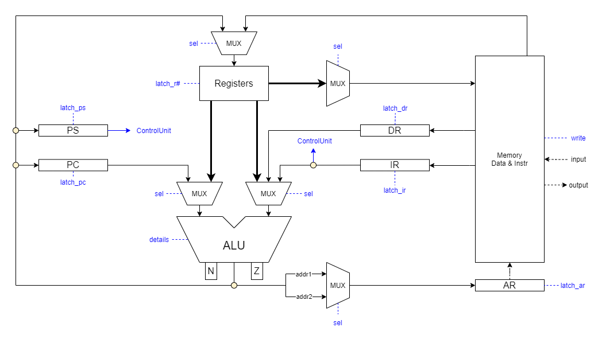

# Архитектура компьютера - Лаб 3

## Автор

> Калинин Даниил Дмитриевич, P33141

## Вариант (с упрощением)

> Исходный вариант: alg | risc | neum | hw | instr | binary | stream | mem | cstr | prob2 | pipeline\
> **Вариант после упрощения**:  asm | risc | neum | hw | instr | struct | stream | mem | cstr | prob2

### Описание варианта

- **asm** - язык программирования синтаксис ассемблера. Необходима поддержка label-ов.
- **risc** - система команд должна быть упрощенной, в духе RISC архитектур:
    - стандартизированная длина команд;
    - операции над данными осуществляются только в рамках регистров;
    - доступ к памяти и ввод-вывод -- отдельные операции (с учётом специфики вашего варианта mem/port);
- **neum** - фон Неймановская архитектура организация памяти
- **hw** - hardwired. Control unit реализуется как часть модели.
- **instr** - процессор необходимо моделировать с точностью до каждой инструкции (наблюдается состояние после каждой инструкции).
- **struct** - машинный код в виде высокоуровневой структуры данных. Считается, что одна инструкция укладывается в одно машинное слово.
- **stream** - ввод-вывод осуществляется как поток токенов. Есть в примере. Логика работы:
    - при старте модели у вас есть буфер, в котором представлены все данные ввода (['h', 'e', 'l', 'l', 'o']);
    - при обращении к вводу (выполнение инструкции) модель процессора получает "токен" (символ) информации;
    - если данные в буфере кончились -- останавливайте моделирование;
    - вывод данных реализуется аналогично, по выполнении команд в буфер вывода добавляется ещё один символ;
    - по окончании моделирования показать все выведенные данные;
    - логика работы с буфером реализуется в рамках модели на Python.
- **mem** - memory-mapped (порты ввода-вывода отображаются в память и доступ к ним осуществляется штатными командами),
    - отображение портов ввода-вывода в память должно конфигурироваться (можно hardcode-ом).
- **cstr** - Null-terminated (C string)
- **prob2** - Even Fibonacci numbers (сумма четных чисел Фибонначи, не превышающих 4 млн).

## Язык программирования

Язык программирования должен поддерживать:

- ветвления
- циклы
- математику
- строки (Null-terminated (C string))
- ввод/вывод
- label-ы

### Форма Бэкуса — Наура

```ebnf
// Команды и прочие элементы языка программирования

<program> ::= <program_line> | <program_line> "\n" <program>

<program_line> ::= <code_line> | <comment> | <code_line> <comment>

<code_line> ::=  <data_definition> | <label_definition> | <command>

<data_definition> ::= <label_definition> "\n" <data>

<data> ::= ".word" <number> | ".word" <string> | ".word" <label_name>

<command> ::= <zero_parameters_instruction> | <one_parameter_instruction> <address> | <two_parameter_instruction> <address> "," <address> | <branch_instruction> <address>

<address> = <label_name> | "(" <label_name> ")"

<label_definition> ::= <label_name> ":"

<label_name> ::= <word> 

<branch_instruction> ::= "jg" | "jz" | "jnz" | "jmp"

<two_parameter_instruction> ::= "add" | "sub" | "mov"

<one_parameter_instruction> ::= "inc" | "dec"

<zero_parameters_instruction> ::= "nop" | "hlt" 

<comment> ::= ";" <text>

// Строки

<string> ::= "'" <text> "'"

<text> ::= <word> | <word> <word>

<word> ::= <character> | <character> <word>

<character> ::= <symbol> | <letter> | <digit>

// Числа

<number> ::= [-] <non-negative number>

<non-negative number> ::= <digit> | <digit> <non-negative number>

// Основные термы

<symbol> ::=  "|" | " " | "-" | "!" | ...

<letter> ::= "a" | "b" | "c" | ... | "z" | "A" | "B" | "C" | ... | "Z"

<digit> ::= "0" | "1" | "2" |  ... | "9"
```

Строке программы может соответствовать:

- Пустая строка
- Комментарий `<comment>`
- Определение метки `<label_definition>`
- Определение данных `<data_definition> = <label_definition> + .word + Данные (число или строка)`
    - Здесь, конечно, 2 строки, но определение данных без обозначения метки не имеет смысла
- Команда `<command> = Инструкция + Адрес1 (если его наличие предусматривает инструкция) + , + Адрес2 (если его наличие предусматривает инструкция)`

### Семантика

- Глобальная видимость данных
- Поддерживаются целочисленные литералы (без ограничений на размер)
- Поддерживаются строковые литералы (Храняться в виде C-string)
    - Пример объявления строковых данных: .word 'Hello'
- Код выполняется последовательно
- Точка входа в программу -- метка _start (метка не может повторяться или отсутствовать)
- Название метки не должно:
    - совпадать с названием команды
    - начинаться с цифры
    - совпадать с ключевым словом .word
- Метки располагаются на строке, предшествующей строке с командой, операнды находятся на одной строке с командами
- Пробельные символы в конце и в начале строки игнорируются
- Любой текст, расположенный в конце строки после символа ; трактуется как комментарий
- Память выделяется статически, при запуске модели.

## Организация памяти

```text
Registers
+------------------------------------+
| R0 - регистр общего назначения     |
+------------------------------------+
| R1 - регистр общего назначения     |
+------------------------------------+
| R2 - регистр общего назначения     |
+------------------------------------+
| R3 - регистр общего назначения     |
+------------------------------------+
| PC - счетчик команд                |
+------------------------------------+
| PS - регистр статуса               |
+------------------------------------+
| AR - регистр адреса                |
+------------------------------------+
| IR - регистр команды               |
+------------------------------------+
| DR - регистр даннных               |
+------------------------------------+

Instruction & Data memory
+-----------------------------------------------+
|    0    :  jmp _start                         |
|    1    :  input_buffer                       |
|    2    :  output_str_buffer                   |
|    3    :  output_int_buffer                   |
|        ...                                    |
| _start  :  program start                      |
|        ...                                    |
|        ...                                    |
+-----------------------------------------------+
```

- Память данных и команд общая (фон Нейман)
- Слова знаковые
- Виды адресации:
    - абсолютная
    - косвенная
- Размер машинного слова равна **48 бит**:
    - Код команды (0-7) = **8 бит**
    - Бит косвенной адресации первого адреса (8) = **1 бит** (0 - прямая адресация, 1 - косвенная адресация)
    - Бит косвенной адресации второго адреса (9) = **1 бит** (0 - прямая адресация, 1 - косвенная адресация)
    - Зарезервировано (10-15) = **7 бит**
    - Адрес_1 (16-31) = **16 бит**, следовательно, в памяти **65536 ячеек**
    - Адрес_2 (32-47) = **16 бит**
    - (На практике кодирование команд реализовано через json)
- Структура PS (регистра состояния):
    - Флаг знака N (0) = **1 бит**
    - Флаг нуля Z (1) = **1 бит**
    - Зарезервировано (3-47) = **45 бит**
    - (На практике представлен словарем ключ-значение с ключами: "N", "Z")
- Адрес **0** зарезервирован для перехода к началу программы

## Система команд

### Безадресные команды

|Код|Команда|N|Z|Описание|Семантика|
|-|-|-|-|-|-|
|0| nop |-|-| Нет операции  | |
|1| hlt |-|-| Останов | |

### Адресные команды

| Код | Команда | N | Z | Адрес 1 | Адрес 2 | Описание | Семантика |
|-|-|-|-|-|-|-|-|
|4| inc |*|*|+| | Инкремент | addr1 + 1 -> addr1 |
|5| dec |*|*|+| | Декримент | addr1 - 1 -> addr1 |
|6| add |*|*|+|+| Сумма addr1 и addr2 | addr1 + addr2 -> addr1 |
|7| sub |*|*|+|+| Разница addr1 и addr2 | addr1 - addr2 -> addr1 |
|8| mov |*|*|+|+| Загрузить в addr1 значение по addr2 | addr2 -> addr1 |
|9| test |*|*|+|+| Логическое И addr1 и addr2 | addr1 & addr2 -> addr1 |

### Команды ветвления

| Код | Команда | N | Z | Адрес 1 | Адрес 2 | Описание | Семантика |
|-|-|-|-|-|-|-|-|
|9| jg |-|-|+| | Перейти по адресу, если флаг N == 0 | |
|10| jz |-|-|+| | Перейти по адресу, если флаг Z == 0 | |
|11| jnz |-|-|+| | Перейти по адресу, если флаг Z != 0 | |
|12| jmp |-|-|+| | Перейти к адресу | addr1 -> IP |

### Кодирование инструкций

- Машинный код сереализуется в список JSON
- Один элемент списка -- одна инструкция

Пример:

```json
[
    {
        "index": 0,
        "opcode": "mov",
        "arg_1": "r1",
        "is_indirect_1": false,
        "arg_2": "r2",
        "is_indirect_2": false
    }
]
```

где:

- `index` - адрес в памяти
- `opcode` - код операции
- `arg_1` - аргумент_1
- `is_indirect_1` - косвенная ли адресация для arg_1
- `arg_2` - аргумент_2
- `is_indirect_2` - косвенная ли адресация для arg_2

Типы данных в модуле [isa](./isa.py), где:

- `Opcode` - перечисление кодов операций

## Транслятор

Интерфейс командной строки: `translator.py <input_file> <target_file>`

Реализовано в модуле: [translator](./translator.py)

Этапы трансляции (функция translate):

- `read_asm` - построчное чтение файла, избавление от отступов и пустых строк
- `translate` - перевод полученных строк файла в машинный код
    - `delete_comments` - удаление комментариев
    - `find_labels` - получение всех меток в коде в формате: ключ - `label_name`, значение - `label_position` (позиция метки в машинном коде)
    - `find_start` - поиск метки `_start` и получение машинного кода команды `jmp _start`
    - `find_words` - получение машинного кода всех слов (`.word`)
    - `find_code` - получение машинного кода всех команд
    - Сложение всех, получившихся машинных кодов `start + words + code`
- `write_code` - запись машинного кода в файл

Правила генерации машинного кода:

- Любая информация о метках пропадает после трансляции в машинный код
- Ошибку компиляции вызовет:
    - Любая неизвестная команда вызовет ошибку компиляции
    - Так как работа с памятью разрешена только команде `mov` и командам ветвления, то использование меток или целых чисел в других командах
    - Любая неизвестная метка при ссылке на неё
    - Повторное задание метки
    - Некорректный тип данных в слове (`.word`)
    - Двойная косвенная адресация, например, `mov (label), (label)`
    - Косвенная адресация с использованием регистров, например, `mov (r0), label` 

## Модель процессора

Интерфейс командной строки: `machine.py <machine_code_file> <input_file>`

Реализовано в модуле: [machine](./machine.py)

### DataPath



Реализован в классе `DataPath`.

`memory` -- однопортовая память, поэтому либо читаем, либо пишем.

Регистры (соответствуют регистрам на схеме):

- `Registers` - регистры общего назначения
    - `r0`
    - `r1`
    - `r2`
    - `r3`
- `pc` - счетчик команд
- `ps` - регистр состояния
- `ar` - адресный регистр
- `ir` - регистр команды
- `dr` - регистр данных, нужен при косвенной адресации

Объекты:

- `input_buffer` - входной буфер данных
    - адрес в памяти = 1
- `output_symbol_buffer` - выходной буфер для символов
    - адрес в памяти = 2
- `output_numeric_buffer` - выходной буфер для чисел
    - адрес в памяти = 3
- `alu` - арифметико-логическое устройство
    - мультиплексоры реализованы в виде Enum (*Selectors*) в модуле [isa](./isa.py)
    - операции алу реализованы в виде Enum (*ALUOpcode*) в модуле [isa](./isa.py)

Сигналы (реализованы в виде методов класса `DataPath`):

- `signal_fill_memory` - заполнить память программой
- `signal_latch_<reg>` - защелкнуть регистр `<reg>`
- `signal_write` - записать в память по адресу в `ar`
- `signal_execute_operation_on_alu` - записать в память по адресу в `ar`

### ControlUnit


Реализован в классе `ControlUnit`.

- Hardwired (реализовано полностью на Python)
- Метод decode_and_execute_instruction моделирует выполнение полного цикла инструкции

Особенности работы модели:

- Цикл симуляции осуществляется в функции `simulation`
- Шаг моделирования соответствует одной инструкции с выводом состояния в журнал (каждая запись в журнале соответсвует состоянию процессора после выполнения инструкции)
- Для журнала состояний процессора используется стандартный модуль `logging`
